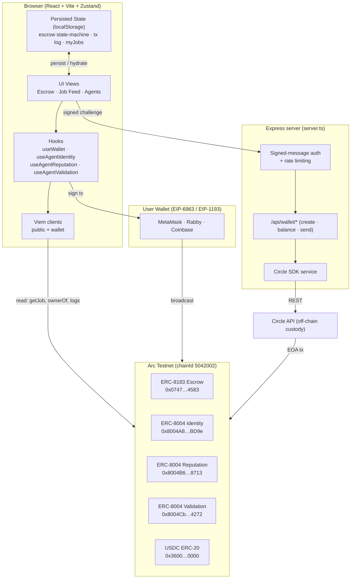
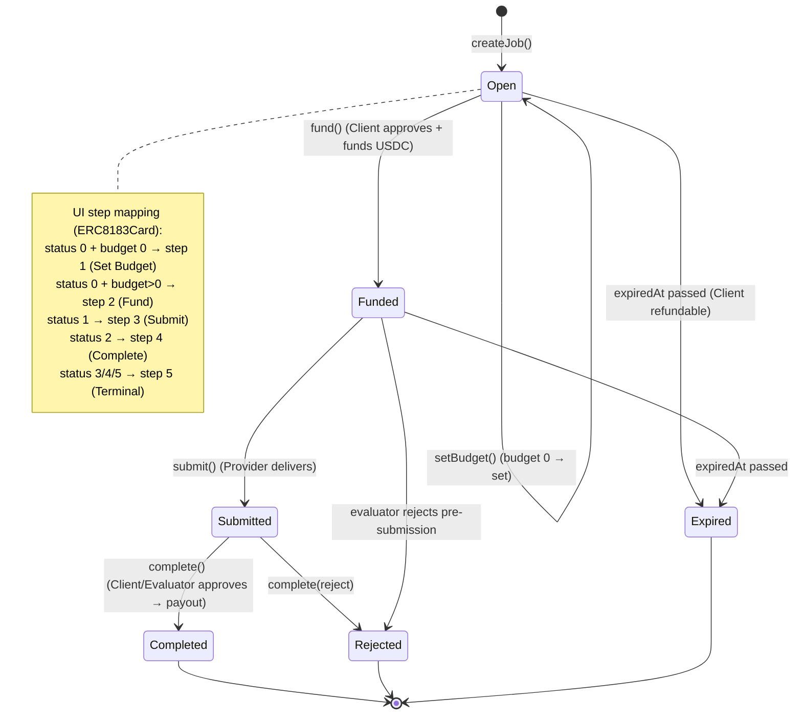
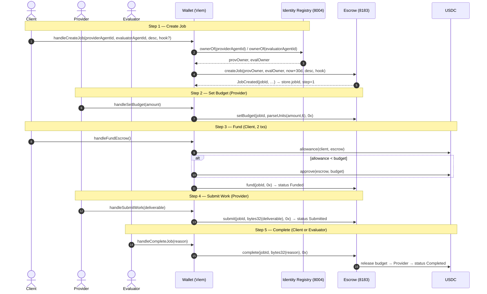
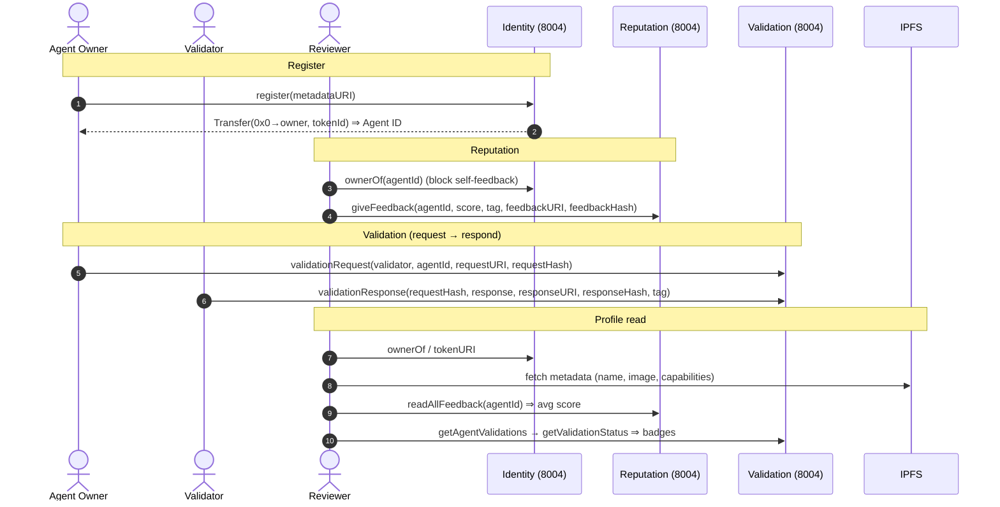
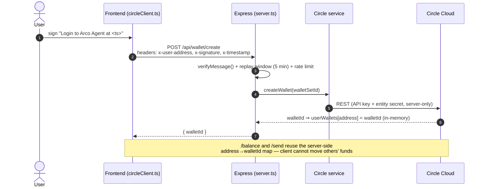
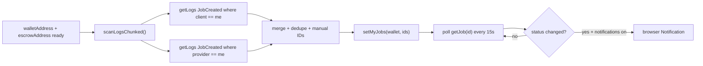

# Arco Agent — Architecture & Flow Reference

Arco Agent is a decentralized application (dApp) for the **Arc Testnet** that
puts a human-friendly UI on top of two emerging Ethereum agent standards:

- **ERC-8183 — Agentic Commerce** (trustless job escrow: Client → Provider → Evaluator)
- **ERC-8004 — Trustless Agents** (Identity, Reputation, Validation registries)

It also integrates **Circle Developer-Controlled Wallets** for programmatic,
server-custodied USDC wallets.

> This document describes **what the app does, what it does not do, and the
> complete operational flow** of every action, with diagrams. For how the
> **Mnemonic Protocol** extends both standards, see
> [`MNEMONIC_EXTENSION.md`](./MNEMONIC_EXTENSION.md).

---

## 1. System at a glance

**Stack:** React 19 · Vite 6 · TailwindCSS 4 · Zustand 5 · Viem 2 · Express 5 ·
Circle Developer-Controlled Wallets SDK · Lucide icons.

**Trust model:** the browser never holds Circle secrets; all Circle calls are
proxied through the Express backend, gated by an EIP-191 signed-message
challenge that proves wallet ownership before a server-side
`userAddress → walletId` mapping is used.

---

## 2. What Arco Agent **does** (capability matrix)

### 2.1 ERC-8183 Agentic Escrow (`Escrow Jobs` view → `ERC8183Card.tsx`)

| Capability | Detail |
|---|---|
| **Create Job** | Client calls `createJob(provider, evaluator, expiredAt, description, hook)`. Provider/Evaluator are supplied as **ERC-8004 Agent IDs**, resolved to owner addresses via `ownerOf` before the tx. Expiry is hardcoded to **30 days**. Optional **hook** contract is validated to be a deployed contract (not an EOA). `jobId` is parsed from the `JobCreated` event. |
| **Set Budget** | Provider-only. `setBudget(jobId, amount, optParams)` in USDC (6-decimals). |
| **Fund Escrow** | Client-only. Two-tx cycle: `approve(escrow, budget)` on USDC (skipped if allowance already sufficient) → `fund(jobId, optParams)`. |
| **Submit Work** | Provider-only. `submit(jobId, deliverable, optParams)`; deliverable is coerced to a `bytes32` (hex passthrough, or UTF-8 → padded hex). |
| **Complete Job** | Client **or** Evaluator. `complete(jobId, reason, optParams)`; releases the locked USDC. `reason` coerced to `bytes32`. |
| **Live state sync** | `getJob(jobId)` is read on load and after each step; the on-chain `status` (0 Open · 1 Funded · 2 Submitted · 3 Completed · 4 Rejected · 5 Expired) is the source of truth and drives the UI step. |
| **My Jobs** | Scans `JobCreated` logs filtered by `client == me` and `provider == me` (chunked, last ~45k blocks) + any manually-loaded IDs; persisted per wallet. |
| **Status polling** | Polls `getJob` for all active jobs every **15 s**; fires a browser `Notification` on status transitions (opt-in). |
| **Expiry countdown** | Per-second countdown to `expiredAt`, with amber/red warning states. |

### 2.2 ERC-8183 Explorer (`Job Feed` view → `JobFeed.tsx`)

| Capability | Detail |
|---|---|
| **Public feed** | Lists all `JobCreated` events on the escrow (last ~5 chunks), de-duplicated, newest first. |
| **Search** | Filter by Job ID, client, or provider address. Click-through loads the job into the escrow lifecycle view. |

### 2.3 ERC-8004 Agents (`Agents` view → `AgentsPage.tsx`)

| Capability | Detail |
|---|---|
| **Register** | `register(metadataURI)` mints an ERC-721 identity; the new Agent ID is parsed from the `Transfer` event. |
| **Profile lookup** | `ownerOf` + `tokenURI` → fetches IPFS metadata (name, image, capabilities) → `readAllFeedback` (avg score) → `getAgentValidations` → per-request `getValidationStatus` rendered as verification badges. |
| **Reputation** | `giveFeedback(agentId, value, decimals, tag1, tag2, endpoint, feedbackURI, feedbackHash)`; guards against self-feedback. |
| **Validation** | `validationRequest(validator, agentId, requestURI, requestHash)` (agent-owner only) · `validationResponse(requestHash, response, responseURI, responseHash, tag)` (validator only) · `getValidationStatus`. |

### 2.4 Wallet & infrastructure

| Capability | Detail |
|---|---|
| **Multi-wallet** | EIP-6963 provider discovery; EIP-1193 connect; auto switch/add Arc Testnet (`wallet_switchEthereumChain` / `wallet_addEthereumChain`). |
| **Balances** | Native ARC + USDC `balanceOf`; low-balance banner with faucet links. |
| **Audit log** | Every tx recorded (hash, action, status, timestamp) in a persisted Zustand store; right-rail timeline + history modal; deep links to ArcScan. |
| **Circle wallets** | Backend `/api/wallet/{create,balance,send}` over Circle Developer-Controlled Wallets, behind signed-challenge auth + rate limiting. |
| **Deep links** | `?jobId=…&escrow=…` query params hydrate the active job. |
| **Custom escrow** | Target escrow address configurable in Settings (defaults to the Arc reference ERC-8183 contract). |

---

## 3. What Arco Agent **does NOT** do (boundaries & gaps)

These are the deliberate (or current) limits — and precisely the seam where a
verifiable-memory layer like **Mnemonic** adds value (see
[`MNEMONIC_EXTENSION.md`](./MNEMONIC_EXTENSION.md)).

| Not handled | Consequence |
|---|---|
| **No verifiable deliverable content** | `submit()` stores only a `bytes32` hash/pointer. The chain proves a job reached *Completed*, **not what was delivered** nor that the artifact is untampered. |
| **No rationale provenance** | `completionReason` and validation `response` are opaque bytes/scores. There is **no signed, auditable explanation** of *why* an evaluator passed or rejected work. |
| **No agent memory across jobs** | An ERC-8004 identity is a static NFT + IPFS JSON. The app keeps **no semantic recall** of an agent's prior jobs, decisions, or deliverables. |
| **No durable backend** | `userWallets` is an **in-memory `Map`** (lost on restart); `myJobs` and tx history live only in **localStorage**. No database, no server-side persistence. |
| **No indexer / subgraph** | Job discovery is bounded log-scanning (~45–50k blocks). **Older jobs silently disappear** from "My Jobs" and the feed. |
| **No autonomous agent** | The "agent" is a wallet + NFT; **a human clicks every step**. There is no orchestration, planning, or automated provider/evaluator logic. |
| **No content storage / pinning** | Relies on user-supplied `ipfs://` URIs; nothing is pinned or content-addressed by the app. Dead links are possible. |
| **No economic security on evaluation** | No staking, slashing, or dispute resolution beyond a binary reject. Evaluator honesty is assumed. |
| **No tests** | Only two ad-hoc scripts (`test-give-feedback.ts`, `test-reputation.ts`); no unit/integration suite. |
| **Single chain, fixed params** | Arc Testnet hardcoded; 30-day expiry hardcoded; USDC treated as 6-decimals in the UI while the chain's native currency is 18-decimals. |

---

## 4. Total detailed flow

### 4.1 Escrow job state machine (ERC-8183)

The contract is the single source of truth; the UI step is **derived** from
`getJob().status` on every read.

### 4.2 Full escrow lifecycle — who does what, on-chain

Every `executeTx` first ensures the wallet is on Arc Testnet
(`switchToArcTestnet` + chainId re-check), `simulateContract` to build the
request, `writeContract` to sign, then `waitForTransactionReceipt` and records
the result in the persisted audit log. Role guards (client/provider/evaluator)
are enforced client-side **before** simulation to give clean error messages.

### 4.3 ERC-8004 agent flows

### 4.4 Circle Developer-Controlled Wallet flow (off-chain custody)

### 4.5 Job discovery (chunked log scanning)

`scanLogsChunked` walks backwards from the latest block in `chunkSize` windows
(default 9000) for up to `maxChunks` iterations — bounding RPC cost but also
bounding history depth (the indexer gap noted in §3).

---

## 5. Source map

| Concern | File |
|---|---|
| Chain config, contract addresses, ABIs | `src/lib/contracts.ts` |
| Escrow lifecycle UI + tx orchestration | `src/components/ERC8183Card.tsx` |
| Public job explorer | `src/components/JobFeed.tsx` |
| ERC-8004 identity/reputation/validation UI | `src/components/AgentsPage.tsx` |
| Identity reads/writes | `src/hooks/useAgentIdentity.ts` |
| Reputation writes | `src/hooks/useAgentReputation.ts` |
| Validation reads/writes | `src/hooks/useAgentValidation.ts` |
| Wallet connect, chain switch, balances | `src/hooks/useWallet.ts` |
| Chunked event scanning | `src/lib/eventScanning.ts` |
| Persisted state machines | `src/store/index.ts`, `src/store/agentStore.ts` |
| Circle frontend client | `src/lib/circleClient.ts` |
| Circle backend service | `src/services/circle.ts` |
| Express API + auth + rate limit | `server.ts` |
