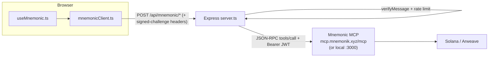
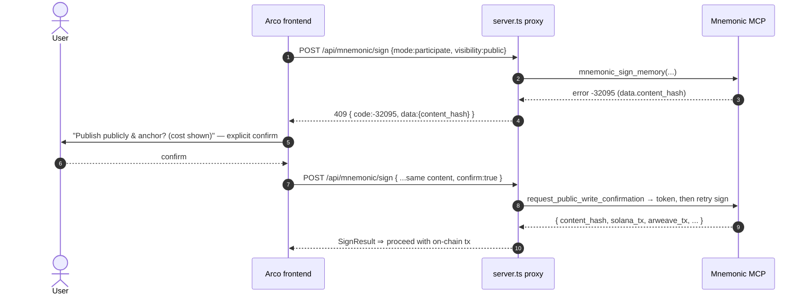

# Arco × Mnemonic — Integration Implementation Plan

This is the build spec for backing Arco Agent's ERC-8004 / ERC-8183 pointer
fields with **verifiable Mnemonic memory**. It is concrete enough to implement
from directly: exact wire formats, config, code stubs, per-file diffs, the
participate-mode confirmation ceremony, error handling, security, tests, and a
phased task checklist.

Conceptual rationale lives in [`MNEMONIC_EXTENSION.md`](./MNEMONIC_EXTENSION.md);
the current app flow in [`ARCHITECTURE.md`](./ARCHITECTURE.md). This document is
the *how to build it*.

---

## 0. Scope & goals

**Goal.** At each point where Arco writes an opaque hash/URI on-chain
(`submit`, `complete`, `giveFeedback`, `validationRequest/Response`), first sign
the underlying content as a Mnemonic memory, and write the returned **blake3
`content_hash`** into the `bytes32` field and a **resolvable handle** into the
string URI field. At each read point, offer **recall + verify** so anyone can
pull the real content back and confirm it is signed and anchored.

**Non-goals (v1).** No change to the ERC contracts or ABIs. No autonomous agent
orchestration. No replacement of IPFS for large binary blobs (Mnemonic stores
the canonical *signed memory*; large files can still live in IPFS/Arweave with
their CID embedded in the memory text).

**Success criteria.**
1. A completed job's deliverable can be recalled by `content_hash` and verified
   (`verified: true`, anchored tx present) by a third party with no Arco state.
2. Reputation feedback carries a real `feedbackHash` (blake3) + dereferenceable
   `feedbackURI`, not `keccak256(tag)` + `""`.
3. Local (free, offline) mode works end-to-end on testnet; participate (anchored)
   mode works with the confirmation ceremony.

---

## 1. Architecture decision — backend proxy

Arco already proxies Circle through its Express backend behind a signed-message
auth challenge. **Mnemonic uses the identical pattern.** The browser never holds
the Mnemonic OAuth JWT; `server.ts` owns the session and forwards JSON-RPC.



**Why proxy, not browser-direct SDK:**
- Keeps the Mnemonic JWT/identity server-side (same trust posture as Circle).
- No CORS fight with the hosted MCP endpoint.
- One server-side identity can sign on behalf of the operator in `local` demo
  mode; per-user identity binding is a Phase 3 concern (§13).

**Alternative (documented, not chosen for v1):** browser-direct via
`@mnemonik-xyz/sdk`. Simpler wiring, but leaks the session to the client and
needs the hosted endpoint to allow the app origin. Revisit if Arco moves to a
fully client-side, user-holds-their-own-key model.

---

## 2. Mnemonic wire reference (authoritative)

Transport: **JSON-RPC 2.0 over HTTP POST** to the MCP endpoint, `method:
"tools/call"`, `params: { name, arguments }`. Auth: `Authorization: Bearer
<jwt>`. Returns are JSON inside the JSON-RPC `result`.

### `mnemonic_sign_memory`
```jsonc
// arguments
{
  "content": "string",                 // the memory text (required)
  "mode": "local" | "participate",     // optional; default local
  "visibility": "public" | "private"   // participate-only; omit for local
}
// result (success)
{
  "content_hash": "<64-hex>",          // blake3 — THIS becomes the bytes32
  "hash_algorithm": "blake3",
  "solana_tx": "...", "arweave_tx": "...",
  "solana_explorer_url": "...", "arweave_url": "...",
  "cose_signature": "...",
  "visibility": "public" | "private"
}
```

### `mnemonic_recall`
```jsonc
{ "query": "string" }                  // semantic search
// → results[] each with { content, content_hash, ... }
```

### `mnemonic_verify`
```jsonc
{ "content": "string", "expected_hash": "<hex>",
  "solana_tx": "...", "arweave_tx": "..." }
// → { status | verified, content_hash, solana_tx, arweave_tx }
```

### `mnemonic_whoami` → operator/agent Ed25519 identity (for identity binding, §13).

### Participate public-write gate
A `mode:"participate"` + `visibility:"public"` write returns JSON-RPC error
**`-32095 PublicWriteRequiresConfirmation`** with `data.content_hash`. The client
must run the confirmation ceremony (§12) and retry. `local` writes never hit this.

---

## 3. The `bytes32` ⇄ blake3 contract (the load-bearing detail)

blake3 `content_hash` is **32 bytes = 64 hex chars**, so it maps **1:1** onto an
EVM `bytes32` with a `0x` prefix. No truncation, no padding, unlike today's
UTF-8 coercion in `ERC8183Card.tsx`.

```ts
// src/lib/mnemonicMap.ts
export const toBytes32 = (contentHash: string): `0x${string}` => {
  const h = contentHash.startsWith('0x') ? contentHash.slice(2) : contentHash;
  if (h.length !== 64 || !/^[0-9a-fA-F]+$/.test(h))
    throw new Error(`content_hash is not 32 bytes: ${contentHash}`);
  return `0x${h.toLowerCase()}` as `0x${string}`;
};

// Resolvable handle stored in the *string* URI fields (description/feedbackURI/…)
export const toRecallURI = (r: { content_hash: string; arweave_url?: string }) =>
  r.arweave_url || `mnemonic://${r.content_hash}`;
```

**Invariant:** the `bytes32` written on-chain MUST equal `0x` + the blake3
`content_hash` of the exact text signed. Verification (§9) recomputes blake3 over
recalled content and asserts equality — that is the entire trust mechanism.

---

## 4. Configuration

```bash
# .env (server-side only — never shipped to the browser)
MNEMONIC_MCP_URL=https://mcp.mnemonik.xyz/mcp   # or http://localhost:3000/mcp for local dev
MNEMONIC_JWT=                                   # OAuth bearer for the operator identity
MNEMONIC_DEFAULT_MODE=local                     # local | participate
MNEMONIC_DEFAULT_VISIBILITY=public              # participate only
```

- Local dev: run `mnemonic-mcp --transport http --port 3000` with
  `STORAGE_MODE=local PAYMENT_MODE=none` (free, offline, no JWT needed) and point
  `MNEMONIC_MCP_URL` at it.
- Production: hosted endpoint + a real `MNEMONIC_JWT`; switch
  `MNEMONIC_DEFAULT_MODE=participate` to anchor on Solana/Arweave.

Add `MNEMONIC_*` to `.env.example` and the production secret manager (same note
as Circle in `README.md`).

---

## 5. Backend — `server.ts` proxy routes

A single JSON-RPC forwarder + three thin endpoints, all behind the **existing**
`requireAuth` middleware and a write rate-limiter.

```ts
// --- Mnemonic forwarder -----------------------------------------------------
const MNEMONIC_URL = process.env.MNEMONIC_MCP_URL!;
const MNEMONIC_JWT = process.env.MNEMONIC_JWT;

async function mnemonicCall(name: string, args: Record<string, unknown>) {
  const res = await fetch(MNEMONIC_URL, {
    method: "POST",
    headers: {
      "Content-Type": "application/json",
      ...(MNEMONIC_JWT ? { Authorization: `Bearer ${MNEMONIC_JWT}` } : {}),
    },
    body: JSON.stringify({
      jsonrpc: "2.0", id: Date.now(),
      method: "tools/call",
      params: { name, arguments: args },
    }),
  });
  const json = await res.json();
  if (json.error) {
    const e: any = new Error(json.error.message || "Mnemonic error");
    e.code = json.error.code;            // e.g. -32095 PublicWriteRequiresConfirmation
    e.data = json.error.data;            // includes content_hash for the ceremony
    throw e;
  }
  // MCP tool results arrive as content[0].text (JSON) or a structured result.
  const r = json.result;
  const text = r?.content?.[0]?.text;
  return text ? JSON.parse(text) : r;
}

app.post("/api/mnemonic/sign", requireAuth, sendLimiter, async (req, res) => {
  try {
    const { content, mode, visibility } = req.body;
    if (!content || typeof content !== "string")
      return res.status(400).json({ error: "content required" });
    const args: Record<string, unknown> = {
      content,
      mode: mode || process.env.MNEMONIC_DEFAULT_MODE || "local",
    };
    if (args.mode === "participate")
      args.visibility = visibility || process.env.MNEMONIC_DEFAULT_VISIBILITY || "public";
    const out = await mnemonicCall("mnemonic_sign_memory", args);
    res.json(out);
  } catch (e: any) {
    // Surface the confirmation gate verbatim so the client can run the ceremony.
    if (e.code === -32095)
      return res.status(409).json({ error: e.message, code: e.code, data: e.data });
    res.status(500).json({ error: e.message || "sign failed" });
  }
});

app.post("/api/mnemonic/recall", requireAuth, async (req, res) => {
  try { res.json(await mnemonicCall("mnemonic_recall", { query: req.body.query })); }
  catch (e: any) { res.status(500).json({ error: e.message }); }
});

app.post("/api/mnemonic/verify", requireAuth, async (req, res) => {
  try { res.json(await mnemonicCall("mnemonic_verify", req.body)); }
  catch (e: any) { res.status(500).json({ error: e.message }); }
});
```

> Reuse the **same** `x-user-address / x-signature / x-timestamp` challenge the
> Circle routes already require — no new auth surface.

---

## 6. Frontend client — `src/lib/mnemonicClient.ts` (new)

Mirrors `circleClient.ts`. Attaches the same signed-challenge headers the
backend already validates (factor the header builder out of the existing wallet
auth code into `src/lib/authHeaders.ts` and reuse it here and for Circle).

```ts
import { buildAuthHeaders } from './authHeaders';

export interface SignResult {
  content_hash: string; hash_algorithm: string;
  solana_tx?: string; arweave_tx?: string;
  solana_explorer_url?: string; arweave_url?: string;
  cose_signature?: string; visibility?: string;
}

export async function mnemonicSign(
  content: string, opts: { mode?: 'local' | 'participate'; visibility?: string } = {},
): Promise<SignResult> {
  const res = await fetch('/api/mnemonic/sign', {
    method: 'POST',
    headers: { 'Content-Type': 'application/json', ...(await buildAuthHeaders()) },
    body: JSON.stringify({ content, ...opts }),
  });
  if (res.status === 409) {
    const body = await res.json();               // confirmation gate (§12)
    const err: any = new Error('PUBLIC_WRITE_REQUIRES_CONFIRMATION');
    err.code = body.code; err.data = body.data; throw err;
  }
  if (!res.ok) throw new Error((await res.json()).error || 'sign failed');
  return res.json();
}

export async function mnemonicRecall(query: string) {
  const res = await fetch('/api/mnemonic/recall', {
    method: 'POST',
    headers: { 'Content-Type': 'application/json', ...(await buildAuthHeaders()) },
    body: JSON.stringify({ query }),
  });
  if (!res.ok) throw new Error((await res.json()).error || 'recall failed');
  return res.json();
}

export async function mnemonicVerify(payload: {
  content?: string; expected_hash?: string; solana_tx?: string; arweave_tx?: string;
}) {
  const res = await fetch('/api/mnemonic/verify', {
    method: 'POST',
    headers: { 'Content-Type': 'application/json', ...(await buildAuthHeaders()) },
    body: JSON.stringify(payload),
  });
  if (!res.ok) throw new Error((await res.json()).error || 'verify failed');
  return res.json();
}
```

---

## 7. Hook — `src/hooks/useMnemonic.ts` (new)

```ts
import { useState } from 'react';
import { mnemonicSign, mnemonicRecall, mnemonicVerify, SignResult } from '../lib/mnemonicClient';
import { toBytes32, toRecallURI } from '../lib/mnemonicMap';

export function useMnemonic() {
  const [isSigning, setIsSigning] = useState(false);

  // Sign content → returns { bytes32, uri, result } ready for the contract call.
  const signForChain = async (
    content: string, mode?: 'local' | 'participate',
  ): Promise<{ bytes32: `0x${string}`; uri: string; result: SignResult }> => {
    setIsSigning(true);
    try {
      const result = await mnemonicSign(content, { mode });
      return { bytes32: toBytes32(result.content_hash), uri: toRecallURI(result), result };
    } finally { setIsSigning(false); }
  };

  return { signForChain, recall: mnemonicRecall, verify: mnemonicVerify, isSigning };
}
```

---

## 8. Wiring the four write points

Each diff is minimal: build the memory text, sign it, substitute the returned
`bytes32` where an opaque hash is currently coerced. **Tag the content** with a
structured prefix (§13) so memories are queryable as a job/agent set.

### 8.1 Submit Work — `ERC8183Card.tsx :: handleSubmitWork`
```ts
// BEFORE: deliverable coerced from store.deliverable to bytes32 by hand.
// AFTER:
const memo = `arco/erc8183 job:${store.jobId} role:provider deliverable\n` +
             `${store.deliverable}`;            // free text and/or ipfs:// CID
const { bytes32, uri } = await signForChain(memo);   // mode from settings
store.setJobData({ deliverable: store.deliverable, deliverableURI: uri });
// submit(jobId, bytes32, optParams)  ← bytes32 IS the blake3 content_hash
return { address: getAddress(...), abi: escrowAbi, functionName: 'submit',
         args: [getValidatedJobId(), bytes32, '0x'] };
```

### 8.2 Complete Job — `ERC8183Card.tsx :: handleCompleteJob`
```ts
const memo = `arco/erc8183 job:${store.jobId} role:evaluator decision:` +
             `${accepted ? 'accept' : 'reject'}\n${store.completionReason}`;
const { bytes32 } = await signForChain(memo);
// complete(jobId, bytes32, optParams)  ← reason is now a signed rationale
```

### 8.3 Reputation — `AgentsPage.tsx :: Reputation.submit` (+ `useAgentReputation`)
```ts
const memo = `arco/erc8004 feedback agent:${agentId} score:${score} tag:${tag}\n${freeText}`;
const { bytes32, uri } = await signForChain(memo);
// giveFeedback(agentId, score, 0, tag, "", "", /*feedbackURI*/ uri, /*feedbackHash*/ bytes32)
```
Replaces the current `keccak256(toHex(tag))` placeholder with a real fingerprint
of real, recallable feedback text.

### 8.4 Validation — `AgentsPage.tsx :: Validation` (+ `useAgentValidation`)
```ts
// request: sign the evidence/criteria
const reqMemo = `arco/erc8004 validation-request agent:${agentId}\n${criteria}`;
const r = await signForChain(reqMemo);
// validationRequest(validator, agentId, /*requestURI*/ r.uri, /*requestHash*/ r.bytes32)

// response: sign the validator's report
const resMemo = `arco/erc8004 validation-response req:${reqHash} result:${pass}\n${report}`;
const v = await signForChain(resMemo);
// validationResponse(reqHash, score, /*responseURI*/ v.uri, /*responseHash*/ v.bytes32, tag)
```

> Store `deliverableURI` / handles in the Zustand escrow store (new optional
> fields) so the read UI (§9) can recall without re-deriving.

---

## 9. Read & verify UI

Add a **"Verify"** affordance wherever a Mnemonic-backed hash is shown
(`AgentProfile` feedback rows, validation badges, the completed-job panel in
`ERC8183Card`, and `JobFeed` detail).

```ts
// Given an on-chain bytes32 + (optional) recalled content:
const v = await verify({ expected_hash: onChainBytes32.slice(2),
                         solana_tx, arweave_tx });
// Render: ✅ "Verified — signed by <id>, anchored <solana_explorer_url> at <T>"
//         ❌ "Hash mismatch / not found"  (tamper or wrong anchor)
```

Verification states to render:
- **Verified + anchored** — `verify` ok and `solana_tx`/`arweave_tx` resolve.
- **Verified, local only** — content matches but `solana_tx` is a synthetic
  `local:` id (testnet/demo). Show a muted "unanchored" badge.
- **Mismatch / not found** — red badge; the on-chain hash does not correspond to
  any recallable signed memory (or content was altered).

For discovery, `recall(query)` powers a "find this agent's prior deliverables"
search on `AgentProfile` (Phase 3, §13).

---

## 10. Data-model additions (Zustand)

`src/store/index.ts` — extend `EscrowState` (all optional, additive, persisted):

```ts
deliverableURI?: string;     // recall handle for the submitted deliverable
deliverableHash?: string;    // blake3 content_hash (== on-chain bytes32 sans 0x)
completionURI?: string;
mnemonicMode?: 'local' | 'participate';
```

No migration needed — Zustand `persist` tolerates new optional keys. Keep the
on-chain `bytes32` as the source of truth; these are convenience pointers for the
read UI.

---

## 11. Settings

`SettingsModal.tsx` — add a **"Verifiable memory"** section:
- Toggle **Mode**: `Local (free, offline)` ↔ `Participate (anchored on Solana/Arweave)`.
- Read-only **operator identity** (from `mnemonic_whoami`) and the MCP endpoint.
- Persist `mnemonicMode` in the app store; pass it into every `signForChain`.

---

## 12. Participate-mode confirmation ceremony

`local` writes are one-shot. A **public participate** write is two-phase: the
first `sign` returns `-32095 PublicWriteRequiresConfirmation` (HTTP 409 through
the proxy) carrying `data.content_hash`; the user must explicitly confirm
publishing content to a public, anchored, paid store before it is written.



**Client UX:** catch `err.code === -32095` from `mnemonicSign`, show a confirm
dialog (surface the cost/visibility), then re-call `/api/mnemonic/sign` with
`confirm:true`. **Backend:** on `confirm:true`, run the
`request_public_write_confirmation` tool to obtain the confirmation token and
re-issue `mnemonic_sign_memory`. Keep `local` mode (the testnet default) free of
this entirely.

> Payment: only `mnemonic_sign_memory` is paid, and only in participate/full +
> HTTP. For the testnet demo stay in `local` (`PAYMENT_MODE=none`); wire payment
> config when enabling participate in production.

---

## 13. Identity binding & tagging convention

**Tagging (do in v1).** Prefix every memory with a structured, greppable header
so a job's artifacts are recallable as a set:
```
arco/erc8183 job:<id> role:<provider|evaluator|client> <kind>
arco/erc8004 <feedback|validation-request|validation-response> agent:<id>
```
This needs **no protocol change** — it is plain text inside `content` (and can
optionally populate `tag1`/`tag2` on the reputation call).

**Identity binding (Phase 3).** Map the ERC-8004 agent owner address ↔ the
Mnemonic Ed25519 identity (`mnemonic_whoami`). Options:
- Record the agent's wallet address inside the signed memory header (weak link).
- Publish the Mnemonic pubkey in the agent's ERC-8004 `metadataURI` JSON and
  cross-check on read (strong, verifiable link).
Pick the second for production so "this memory was authored by Agent #7's
identity" is provable, not asserted.

---

## 14. Error handling & edge cases

| Case | Handling |
|---|---|
| Mnemonic endpoint down | `mnemonicCall` throws → surface "memory service unavailable"; **do not** broadcast the on-chain tx with a placeholder hash (fail closed). |
| `-32095` confirmation gate | 409 → run ceremony (§12); never auto-confirm a public paid write. |
| JWT expired (`-32099`) | Proxy returns a clear "re-authenticate Mnemonic" error; operator refreshes `MNEMONIC_JWT`. |
| `content_hash` not 32 bytes | `toBytes32` throws before any tx — guards against a malformed/sha256 response. |
| Large deliverable | Put the blob in IPFS/Arweave, sign a memory that *contains the CID + summary*; the bytes32 still fingerprints the signed memory. |
| Local vs participate hash parity | blake3 over identical content is identical across modes, so a `local` testnet hash verifies against a later `participate` re-anchor of the same text. |
| Recall returns multiple hits | Verify by exact `content_hash`, not by ranked similarity, before trusting. |

---

## 15. Security

- Mnemonic JWT and any payment secret live **only** in `server.ts` env — never
  shipped to the browser (same rule as `CIRCLE_*`; add to `.gitleaks`/`.env`).
- All `/api/mnemonic/*` routes sit behind the existing signed-challenge
  `requireAuth` + the write rate-limiter.
- Treat recalled content as untrusted external data when rendering (escape;
  it may come from other agents).
- Fail closed: a signing/anchoring failure must abort the on-chain step, not
  fall back to a fake hash.

---

## 16. Testing

- **Unit:** `toBytes32` (valid 64-hex, reject short/sha256/non-hex), `toRecallURI`.
- **Backend:** mock `mnemonicCall`; assert `/sign` maps args, `/sign` 409 on
  `-32095`, auth required on all three routes.
- **Integration (local MCP):** spin `mnemonic-mcp` in `local` mode in CI; run
  sign → recall → verify round-trip; assert recomputed blake3 == on-chain bytes32.
- **E2E (testnet):** full job: create → budget → fund → **sign+submit** →
  **sign+complete** → recall+verify the deliverable from a clean session.
- Extend the existing ad-hoc `test-give-feedback.ts` / `test-reputation.ts` to
  assert a real `feedbackHash`/`feedbackURI` round-trips.

---

## 17. Phased rollout / task checklist

**Phase 1 — plumbing (no UX change to the happy path)** — ✅ implemented
- [x] `authHeaders.ts` (shared signed-challenge header builder)
- [x] `server.ts`: `mnemonicCall` + `/api/mnemonic/{sign,recall,verify}`
- [x] `mnemonicMap.ts` (`toBytes32`, `toRecallURI`) + `test-mnemonic-map.ts`
- [x] `mnemonicClient.ts`, `useMnemonic.ts`
- [x] `.env.example` + README `MNEMONIC_*` docs

**Phase 2 — wire writes + mode** — ✅ implemented
- [x] `handleSubmitWork` / `handleCompleteJob` sign before tx
- [x] `Reputation` / `Validation` sign before tx (hooks accept URI + hash)
- [x] Zustand fields (§10: `deliverableURI/Hash`, `completionURI`, `mnemonicMode`)
- [x] `SettingsModal` mode toggle (§11)
- [x] Participate confirmation ceremony — server retry path (§12)
- [x] Read-side "Verify" affordances — `MnemonicVerify` in `AgentProfile`
      feedback rows + in-session deliverable panel (§9)

**Phase 3 — memory as a feature** — ✅ implemented
- [x] Operator memory identity via `/api/mnemonic/whoami` + `useMnemonic.whoami`,
      surfaced in `SettingsModal` (read-side identity display)
- [x] `recall`-powered "prior deliverables" search on `AgentProfile`
      (`AgentMemory` panel)
- [x] Per-agent memory timeline (recalled signed memories with anchored badge)
- [ ] Strong identity binding: publish the Mnemonic pubkey inside the ERC-8004
      `metadataURI` JSON and cross-check on read (convention; needs a metadata
      authoring step — follow-up)

---

## 18. Mnemonic-side changes

**Required: none.** sign/recall/verify are content-agnostic; blake3 already fits
`bytes32`; per-identity scoping exists.

**Optional (nice-to-have, non-blocking):**
- Documented **`mnemonic://<content_hash>`** URI scheme + resolver so the ERC URI
  fields dereference by convention rather than ad-hoc Arweave URLs.
- A **verify-by-bytes32** convenience input (accept a raw `0x…` 32-byte hash).
- A published **artifact tag convention** (`arco/erc8183 …`) in Mnemonic docs so
  cross-app recall is interoperable.

---

### References
- Current app flow — [`ARCHITECTURE.md`](./ARCHITECTURE.md)
- Conceptual model — [`MNEMONIC_EXTENSION.md`](./MNEMONIC_EXTENSION.md)
- ERC-8004 / ERC-8183 / Mnemonic — see `MNEMONIC_EXTENSION.md` §References
