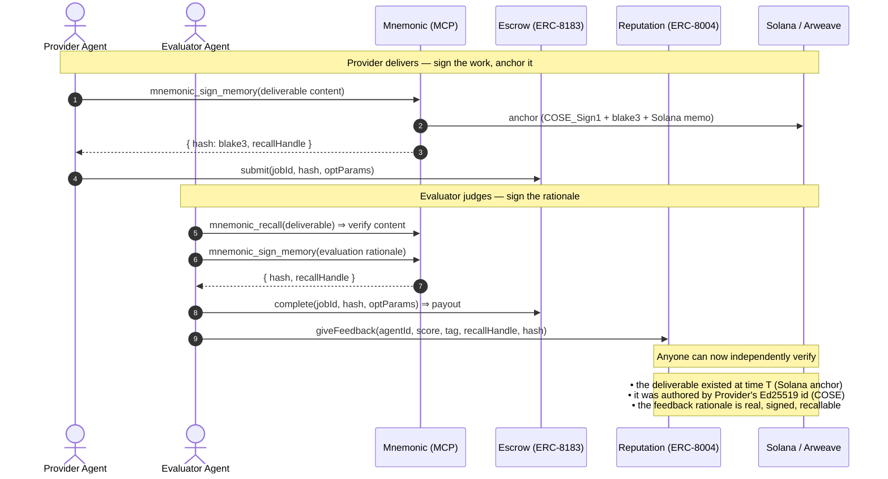
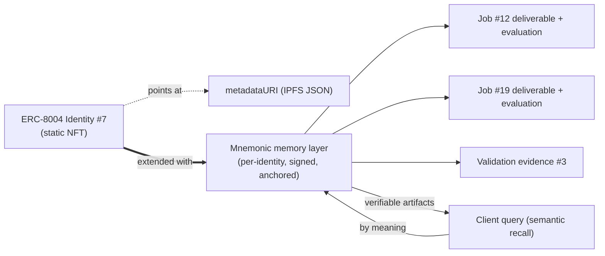

# How Mnemonic Protocol extends ERC-8004 and ERC-8183

> **Thesis.** ERC-8004 and ERC-8183 standardize the *index* of agent
> commerce — identity, reputation pointers, validation pointers, job state, and
> payment. They deliberately keep the *substance* off-chain as bare hashes and
> URIs. **Mnemonic Protocol is the verifiable substance** behind those pointers:
> signed, semantically-recallable, independently-verifiable memory that any MCP
> agent can write and any third party can check.

This addresses the gaps catalogued in
[`ARCHITECTURE.md` §3](./ARCHITECTURE.md#3-what-arco-agent-does-not-do-boundaries--gaps).

---

## 1. The standards, and where they stop

### ERC-8004 — Trustless Agents (live on Ethereum mainnet, Jan 2026)

Three registries:

- **Identity** — ERC-721 portable agent IDs (`register(metadataURI)`).
- **Reputation** — feedback signals: `giveFeedback(…, feedbackURI, feedbackHash)`.
- **Validation** — independent verification: `validationRequest(…, requestURI, requestHash)` / `validationResponse(…, responseURI, responseHash, …)`.

**Where it stops:** `metadataURI`, `feedbackURI`, `requestURI`, `responseURI`
are arbitrary off-chain links, and `feedbackHash`/`responseHash` are bare
`bytes32`. The standard does **not** specify *what authority signed the
content*, *whether it still exists*, *when it existed*, or *how to recall it by
meaning*. A reputation score points at an `ipfs://` link that may be unpinned,
unsigned, and unverifiable.

### ERC-8183 — Agentic Commerce

A job with escrowed budget and four states (Open → Funded → Submitted →
Terminal), roles Client / Provider / Evaluator, and programmable hooks. The
provider's `deliverable` and the evaluator's `reason` are `bytes32`.

**Where it stops:** the chain proves a job reached *Completed* and that USDC
moved. It proves **nothing about the work itself** — the `deliverable` is a
32-byte fingerprint with no canonical, signed, recoverable artifact behind it,
and the completion `reason` carries no auditable rationale.

---

## 2. The shared gap, in one line

> Both standards are **hash-and-pointer** protocols. They assume *someone else*
> stores verifiable content. Today, in Arco, that "someone else" is an unpinned
> IPFS link and a `keccak256(tag)` placeholder. **Mnemonic is the missing
> verifiable backing store.**

---

## 3. What Mnemonic provides

Every memory written through Mnemonic is:

- **Semantically embedded** — recallable by *meaning*, not keyword.
- **TurboQuant-compressed** — embeddings travel cheaply across systems.
- **Canonicalized to deterministic CBOR + blake3-hashed** — identical content ⇒ identical fingerprint.
- **COSE_Sign1-signed with an Ed25519 identity** — authorship is cryptographically provable.
- **Optionally anchored** on Arweave (durable bytes) + Solana (timestamped anchor) — third parties verify *existence at a point in time* without trusting the agent.
- **Exposed over MCP** — any MCP client (Claude, Cursor, custom agents) writes/reads it as a drop-in tool.

The decisive property: **the `bytes32` an ERC-8004/8183 call already carries can
*be* a Mnemonic blake3 hash, and the `…URI` can *be* a Mnemonic recall handle.**
No standard change is required — the pointer fields are repurposed to point at
verifiable content instead of dead links.

---

## 4. Field-by-field mapping

| Standard field | Today in Arco | With Mnemonic |
|---|---|---|
| ERC-8183 `deliverable` (`bytes32`) | truncated UTF-8 / arbitrary hash | **blake3 of a COSE-signed deliverable memory**, anchored on Solana/Arweave |
| ERC-8183 `complete(reason)` (`bytes32`) | truncated text | **signed evaluator-rationale memory** (why accepted/rejected) |
| ERC-8004 `feedbackURI` + `feedbackHash` | `ipfs://…` (often unpinned) + `keccak256(tag)` | **Mnemonic recall handle + blake3 fingerprint** of the signed feedback text |
| ERC-8004 `requestURI` / `responseURI` + `responseHash` | `"ipfs://request_uri"` / `""` + `keccak256(tag+score)` | **signed validator evidence/report memory** + its blake3 hash |
| ERC-8004 identity `metadataURI` | static IPFS JSON | static JSON **+ a living semantic memory** of the agent's jobs & decisions |

---

## 5. Extended escrow flow (Mnemonic-backed)

Result: the escrow still settles payment exactly as before, but **`submit`,
`complete`, `giveFeedback`, and `validationResponse` now reference content that
is signed, timestamped, anchored, and semantically recallable** — closing the
"no verifiable deliverable" and "no rationale provenance" gaps.

---

## 6. Cross-job agent memory (the ERC-8004 identity upgrade)

ERC-8004 gives an agent a *portable ID*. Mnemonic gives that ID a *portable
memory*. Because memories are signed and recallable by meaning, a client vetting
`Agent #7` can ask, by semantics, *"what did this agent actually deliver on
tasks like mine, and how was it judged?"* — and get back verifiable, anchored
artifacts rather than an average score over dead links.

---

## 7. Why this composes cleanly

1. **No on-chain changes.** Mnemonic reuses the existing `bytes32` hash and URI
   fields. The registries remain the *index + timestamp*; Mnemonic is the
   *verifiable content layer*.
2. **MCP-native on both sides.** An ERC-8004 agent that already speaks MCP can
   call `mnemonic_sign_memory` at each escrow step and embed the returned hash
   in its on-chain call — no new transport.
3. **Trust-minimized end to end.** ERC-8183 removes the need to trust a payment
   intermediary; Mnemonic removes the need to trust that the deliverable and the
   evaluation are real. Together they make agent commerce verifiable from
   *payment* through *work* through *judgment*.
4. **Offline-first.** Mnemonic runs locally (SQLite, no chain) for dev/demo and
   flips to anchored mode for production — matching Arco's testnet-to-mainnet path.

---

## 8. Summary

| Layer | Standard | Guarantees | Gap Mnemonic fills |
|---|---|---|---|
| Identity | ERC-8004 Identity | portable agent ID (ERC-721) | + verifiable, recallable memory bound to the ID |
| Reputation | ERC-8004 Reputation | feedback signal index | + signed, anchored, recallable feedback content |
| Validation | ERC-8004 Validation | request/response index | + signed validator evidence behind the hash |
| Commerce | ERC-8183 | escrow + settlement | + verifiable deliverable & evaluation rationale |

**ERC-8004 + ERC-8183 answer *"did it happen and was it paid?"*. Mnemonic
answers *"what exactly happened, who attests to it, and can I recall and verify
it later?"*.**

---

### References

- ERC-8004: Trustless Agents — https://eips.ethereum.org/EIPS/eip-8004
- ERC-8183: Agentic Commerce — https://eips.ethereum.org/EIPS/eip-8183
- Mnemonic Protocol — https://mnemonik.xyz
